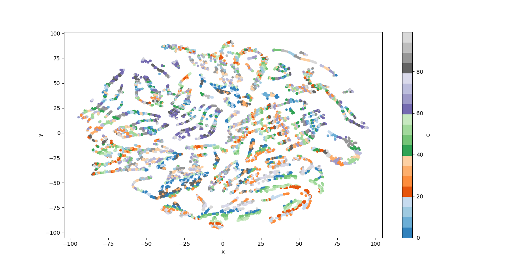

# Generar contestaciones: cómo aprender modelos monolingües especializados que ayuden en contextos con pocos datos

##### Lautaro Martinez

---

### Objetivo

En el presente trabajo, se busca el entrenamiento de un modelo capaz de generar contestaciones a preguntas (o sentencias en general) sin contexto previo.

### Requisitos

Este proyecto fue implementado con Python 3.9 y se requieren las siguientes librerias instaladas para su funcionamiento:

* [Pandas](https://pandas.pydata.org/)
* [Numpy](https://numpy.org/)
* [PyTorch](https://pytorch.org/)
* [Scipy](https://scipy.org/)
* [Scikit-Learn](https://scikit-learn.org/stable/index.html)
* [NLTK](https://www.nltk.org/)
* [GENSIM](https://radimrehurek.com/gensim/)
* [emoji](https://pypi.org/project/emoji/)
* [Sentence-Transofmers](https://www.sbert.net/)

### Dataset
Para el entrenamiento de un modelo, es fundamental contar con un dataset que congtenga muchos ejemplos para aprender.
En este trabajo, se utilizo el dataset creado por Mariano Schmidt.
El dataset contiene tweets relacionados a la vacunacion contra COVID-19 en Argentina representado en los siguientes campos
|created_at   |id_str   |full_text   |in_reply_to_status_id   |in_reply_to_user_id   |user.id   |
|:-:|:-:|:-:|:-:|:-:|:-:|

donde:

* created_at: contiene la fecha de envio del tweet a la aplicacion.
* id_str: contiene el ID especifico del tweet en cuestion.
* full_text: contiene el texto generado por el usuario del tweet.
* in_reply_to_status_id: de existir, contiene el ID del tweet al cual se esta respondiendo.
* in_reply_to_user_id: de existir, contiene el ID del usuario del tweet al cual se estra respondiendo.
* user.id: contiene el ID especifico del usuario que creo el tweet.

El dataset contiene 163.180 tweets en espanol.

### Hipotesis y consideraciones

El trabajo de entrenar un modelo es arduamente computacional, por lo cual en ciertos momentos recortaremos ciertos ejemplos. Con esto hay que dejar en claro que lo presente se trata de un prototipo muy basico, pero tendra lo minimo requerido para que podamos tomar conclusiones futuras y realizar predicciones.
Ademas, como el dataset de entrenamiento esta reducido a un topico (vacunacion contra COVID-19 en Argentina), es de esperarse que el modelo resultante logre un buen rendimiento en predicciones de dicho topico, y pobre en otros.
Otra caracteristica de este modelo que considero es importante de mencionar, es su desempeno relacionado a la longitud de la pregunta a la cual queremos predecir una respuesta; esto es debido al trabajo con tweets, que cuentan con una longitud maxima de 280 caracteres.

# Proyecto

#### Roadmap

Para lograr el objectivo, se dividira en proyecto en dos grandes partes:

1) Clustering de respuestas.
En esta primer parte, buscaremos agrupar aquellas respuestas las cuales sean semejantes, desde una dimension estructural hasta semantica.
2) Entrenamiento del modelo.
Con los cluster de respuestas, entrenaremos un modelo por cluster para que aprenda los patrones de las respuestas semejantes. De esta forma esperamos que sea capaz de generar contestaciones bien formuladas acorde a la pregunta.

Esto es lo que esperamos realizar, pero veremos mas adelante que deberemos modificar y bajar a otro baseline por ciertas restricciones.
Ademas, para completar el modelo existiria una tercer parte; aquella que dada una pregunta le asigne un cluster para el cual extraer el modelo que mejor responde dicha pregunta.
Esta parte no sera implementada en el presente proyecto por restricciones de tiempo y debido a que le prestaremos un foco especial a las dos mencionadas previamente que son de mayor interes.

## Etapa 1: Clustering

En esta etapa comenzamos estudiando los datos.
Como se menciono previamente, se tratan de tweets; esto es particular pues tienen un maximo de 280 caracteres permitidos, de cualquier forma, los usuarios de la plataforma se las han ingeniado para que esto no limite su expresividad. Su solucion, los threads.
Para definir los threads, diferenciemos ciertos tipos de tweets:

* **Trigger**: Tweet generado por usuario que *tiene* una respuesta o mas Answers asociadas.
* **Answer**: Tweet generado por usuario que *es* respuesta a otro tweet.

en nuestro dataset, conocer si un tweet se trata de un Trigger o Answer es muy sencillo; basta con chequear sus campos `in_reply_to_status_id` y `in_reply_to_user_id`. Si estos campos existen, entonces se trata de un Answer y de lo contrario, de un Trigger.

De esta forma, podemos definir los threads de una forma sencilla como el conjunto de un Trigger y todas las Answers de dicho Trigger generadas por el mismo usuario.
Esta definicion es muy amplia, y poco real, pero es una buena primer aproximacion al caso.
Con los threads, los usuarios logran superar las limitaciones que exije Twitter. Pero hay algo importante de notar aqui, las Answers del Trigger del thread continuan lo que viene exponiendo el Trigger. Es decir, contar con el Trigger y las Answers es equivalente a concatenar el Trigger con las Answers en orden y trabajar con ese unico gran Tweet.

> Observacion: En Twitter, un Answer puede ser a su vez un Trigger de otras Answers por su estructura de arbol que tiene un solo tweet. Estos casos no seran contemplados en el proyecto.

Lo mencionado previamente, se trata de nuestro primer paso en el preproceso de los datos; transformar threads en un solo tweet y descartar el Trigger y las Answers que lo componen por separado.

En un paso futuro, para poder agrupar las respuestas, deberemos representar nuestros datos en un vector de varias dimensiones. Mas adelante hablaremos de las distintas caracteristicas (features) que utilizaremos, pero algunas estaran relacionadas con la cantidad de emojis, URLs, hashtags y menciones a otros usuarios, es por ello que podemos, en nuestro preproceso, obtener estos datos para minimizar el tiempo a la hora de vectorizarlos.

De esta forma, nuestro preproceso quedaria conformado por:

* Tratamiento de threads.
* Contar emojis, URLs, hashtags y menciones a otros usuarios.

Todo esto es una tarea pesada computacionalmente, sobretodo el tratamiento de threads que cuenta con complejidad O(n^2) pues por cada tweet debemos recorrer todos los demas para conocer sus atributos. Es por ello que se decidio armar una representacion intermedia del dataset original.

De es esta forma, se creo el script `dataset_transform.py` que se encarga de crear un archivo CSV que cuenta con los siguientes atributos:

|id   |tweet   |reply_to_id   |reply_to_user_id   |user_id   |username   |emoji   |url   |hashtag   |is_trigger   |
|:-:|:-:|:-:|:-:|:-:|:-:|:-:|:-:|:-:|:-:|

donde:

* id: idem a id_str en el dataset original
* tweet: idem a full_text en el dataset original
* reply_to_id: idem a in_reply_to_status_id en el dataset original
* reply_to_user_id: idem a in_reply_to_user_id en el dataset original
* user_id: idem a user.id en el dataset original
* username: la cantidad de menciones a otros usuario en el tweet
* emoji: la cantidad de emojis utilizados en el tweet
* url: la cantidad de URLs utilizadas en el tweet
* hashtag: la cantidad de hashtags utilizadas en el tweet
* is_trigger: valor 1 si se trata de un Trigger, 0 caso contrario.

En esta representacion intermedia ya fueron tratado los threads, de forma que, ahorramos calculo repetitivo.

Podemos conciderar lo hecho hasta el momento como un preproceso de los datos, pero notemos que el texto de los tweets presentan irregularidades:

* Tweets mal formateados en el dataset aparece el salto de linea de forma explicita en el texto (`\n`).
* URLs no aportan demasiada informacion.
* hashtags aportan informacion pero que se ve demasiado dependiente de la jerga de los usuarios y no es de relevancia en las respuestas.
* emojis, su mayor complejidad recae en su enorme dependencia del contexto. El hecho de no tratarse de palabras, sino mas bien de "imagenes" permiten un uso amplio en diversos entornos y culturas lo cual dificulta su significado concreto en el texto.
* Menciones a otros usuarios, en general son nombres validos precedidos por un '@'.

Para tratar estas irregularidades, se procedio con lo siguiente:

1) Corregir los tweets donde el salto de linea es explicito por un salto de linea real. Pues esa es la intencion real del usuario que lo genero.
2) URLs y hashtags reemplazarlos por tokens (`URL_TOKEN` y `HASHTAG_TOKEN` respectivamente). De esta forma mantenemos la informacion que representan en posicion y relevancia, pero no particularizamos cada aparicion del mismo. Esto sera importante mas adelante para la vectorizacion de la palabras.
3) Eliminamos los emojis, su tratamiento es complejo y varia demasiado. Otro camino que puede tomarse hubiera sido reemplazar los emojis por sus palabras, pero esto en muchas situaciones generaba un texto con poco sentido. Si el modelo entrenado final aprendiera esto, tendriamos palabras sueltas que deberiamos post-procesar para suplantarlas por sus emojis correspondientes.
4) Eliminar el @ en la mencion de usuarios. De esta forma tratamos los nombres de usuario como nombres concretos.

> Observacion: En una prueba inicial se reeplazaron los emojis por `EMOJI_TOKEN` para evaluar los clusters resultantes y dictaminar que camino elegir al momento de trabajar con ellos.
Los clusters resultantes con `EMOJI_TOKENS` estuvieron muy dispersos en vista del uso de los tokens. Cuando se eliminaban, aquellas respuestas de puros emojis o con gran cantidad permanecieron agrupadas lo cual buscamos efectivamente.

Algo importante que notar es la informacion que acarrean los URLs, hashtags, menciones y emojis. Cierta parte de esta informacion la perdemos eliminando los emojis, pero ganamos en la simplicidad del preproceso. Ahora bien, hacer lo mismo con URLs y hashtags es muy distinto y contraproductivo.
En una respuesta, podemos diferenciar su tipo; lo cual es muy dependiente de las componentes de la respuesta. Miremos el siguiente ejemplo

- *Anda a leer shorturl.at/hnyLO por favor!*

podemos calificarlo como informativo, el usuario que escribio el texto busca que el que lo reciba, lea la informacion presente en el link.
Veamos como el tipo cambia drasticamente si removieramos las URLs:

- *Anda a leer por favor!*

El resultado es una respuesta que muchos calificamos como insulto/hiriente, pues trata al que lo lee de ingenuo en el topico que se discute.
Con este ejemplo simple, podemos ver la importancia que tienen en concepto de informacion que acarrean los componentes como URLs, hashtags y emojis.

Para manejar todos estos tweets y el preproceso que cada uno conlleva, se creo el script `Tweet_utils.py`, el cual contiene la clase Tweet donde se guarda informacion de la representacion intermedia del dataset y contiene el metodo `process` para llevar a cabo el preproceso descripto anteriormente.

Ya con los datos procesados, y tweets preprocesados; podemos seguir con la parte mas importante de este proyecto.

#### Seleccion de caracteristicas (features)

Como dijimos previamente, el objetivo de esta etapa es agrupar respuestas semejantes, esto es:

* Desde un lado estructural, uso de links, emojis, hashtags, mencion a otros usuarios, su longitud y relacion con la pregunta.
* Desde un lado de contenido, la semantica de la respuesta.

##### Iteracion #1

Para ello, en una primer iteracion del clustering se utilizaron las siguientes caracteristicas:

* longitud del Trigger
* longitud del Answer
* Cantidad de emojis usados en el Trigger
* Cantidad de emojis usados en el Answer
* Cantidad de hashtags usados en el Trigger
* Cantidad de hashtags usados en el Answer
* Cantidad de menciones en el Trigger
* Cantidad de menciones en el Answer
* Cantidad de URLs usadas en el Trigger
* Cantidad de URLs usadas en el Answer

Notar que todas estas features son puramente estructurales. Los clusters resultantes fueron buenos en este sentido. Se encontraron clusters con exclusivo uso de emojis o urls, ademas de clusters donde las respuestas eran largas, medianas o cortas.
De cualquier modo, esto no satisface el objetivo pero es una buena primer aproximacion.

##### Iteracion #2

En una segunda iteracion se quiso acercar mas las respuestas por su contenido. Para ello, una solucion sencilla fue utilizar los Word Embeddings de las palabras que conforman el Trigger y el Answer utilizando asi las features:

* Utilizadas en Iteracion #1
* Embeddings de 300 dimensiones de las palabras del Trigger
* Embeddings de 300 dimensiones de las palabras del Answer

Para obtener un unico vector que represente a todas las palabras, se realizo una suma vectorial de cada vector individual.

Con estas features, obtuvimos clusters muy similares a los actuales del proyecto.
Se mantienen clusters con emojis y URLs aunque ahora un poco mas mezclados entre ellos. Clusters que mencionan a un usuario por ser una respuesta directa al Trigger estan cercanos gracias a los embeddings utilizados donde priorizamos las palabras utilizadas y su contexto en la sentencia.

> El codigo para realizar clustering se extrajo de un trabajo previo realizado. El algoritmo de clustering utilizado se trata del K-Means donde se le debe proveer una distancia a utilizar.
En el codigo original se utilizo mediante la distancia coseno, arrojando los siguientes clusters en nuestra busqueda de asemejar respuestas:

> Aqui las respuestas en un mismo cluster son del mismo color.
Notar como todos se encutran dispersos en la imagen. Podemos "dibujar lineas" con los elementos del mismo cluster viendo asi la distancia coseno.
Cambiando a una distancia euclidea, se obtuvieron clusters mas compactos y efectivos:

##### Iteracion #3

En esta ultima iteracion se quiso utilizar una feature que permita relacionar fuertemente el texto del Trigger y el texto de la Answer; esta relacion de, "respuesta a pregunta".
Para ello, se utilizo la [metrica BLEU](https://es.wikipedia.org/wiki/BLEU).
Esta metrica toma dos sentencias y retorna un valor en [-1, 1] siendo que un valor mas grande expresa gran relacion de similitud entre las dos sentencias de entrada.
Notar que es una metrica de similitud, pero nos es suficiente para obtener la relacion buscada, pues generalmente la respuesta a una pregunta es similar en topicos estructurales.
La metrica BLEU es altamente utilizada por ello en la evaluacion de traducciones.
De esta forma, las features utilizadas fueron:

* Utilizadas en iteracion 2
* Metrica BLEU

Los clusters resultantes no se observo una diferencia sustancial como entre las iteraciones anteriores. Pero las respuestas similiares estaban aun mas agrupadas en un mismo cluster.
Se pueden encontrar clusters con emojis y urls como en la iteracion anterior, respuestas a un mismo tweet, ademas, los clusters no estan tan segmentados por la longitud de las respuestas como pasaba previamente.

> 
Plot de clusters con distancia coseno

Plot de cluster con distancia euclidea. Clusters mas compactos.

Asi concluye la Etapa 1 de clustering de respuestas similares.

En el archivo `Clustering_utils.py` se encuentran funciones para clusterizar, plotear clusters y guardar los resultados.
En el archivo `WordEmbeddings.py` se encuentra la funcion para obtener el modelo de Word2Vec para obtener los embeddings de las palabras de 300 dimensiones.

## Etapa 2: Entrenar un modelo

Esta segunda etapa es fundamental al objetivo del proyecto. Queremos *entrenar* un modelo capaz de *generar* contestaciones.
Pero esto supone muchas dificultades a la hora de llevar a la practica:

1) No se cuenta con gran procesamiento suficiente para entrenar un modelo desde cero.
2) No se encuentra ni remotamente con la cantidad de datos necesarios para entrenar un modelo desde cero.

Este ultimo punto se ve aun mas afectado por el hecho que deseamos entrenar un modelo por cluster. Es decir, ni siquiera contamos con todos los pares de Trigger y Answer del dataset para entrenar un modelo.

A raiz de lo expresado, la decision tomada fue de **bajar el baseline**.
Si bien nuestro objetivo era *entrenar* un modelo para *generar* contestaciones; podemos *fine-tunear* un modelo para contestar.

Con este nuevo objetivo en mente se comenzo a buscar un modelo para fine-tunear y esto supuso muchos obstaculos.
Claramente buscamos un modelo [Seq2Seq](https://en.wikipedia.org/wiki/Seq2seq), que nos permita convertir una secuencia de entrada (Trigger) a una de secuencia de salida (Answer). Asi el modelo aprende como transformar una secuencia en otra, en nuestro caso: como transformar una pregunta en una respuesta.
Al buscar modelos para fine-tunear con nuetro objetivo, se encuentran una amplia variedad de posts, papers y proyectos armados de como fine-tunear un modelo para contestacion de preguntas *en contexto*, y esto es fundamental.
Nuestra tarea es fine-tunear un modelo en contestacion a preguntas **sin contexto**.
En la contestacion con contexto, se entrena el modelo dando como input un documento, una pregunta cuya respuesta se encuentra en el documento, y los indices de comienzo y terminacion de la respuesta a la pregunta en el documento.
Esto es para nada viable con nuestro objetivo; nuestros Triggers no contienen las Answers buscadas, pues estas son generadas por usuarios.

Esto supuso un grado mayor de dificultad para encontrar un modelo que fine-tunear con nuestros objetivos.

Otro camino que se intento fue el de fine-tunear un chatbot.
Si los pensamos con detenimiento, un chatbot recibe un Trigger y devuelve un Answer sin contexto.
El problema con esto, es la gran dificultad que supone fine-tunear un chatbot ademas de la escaces de ejemplos que contamos.

Finalmente luego de lectura de varios posts en distintas paginas, se tomo un paso atras para cambiar la estrategia de busqueda.
Un tiempo atras se hablo de SBERT o sentence-bert, el cual es una modificacion al modelo pre-entrenado BERT que utiliza red siamesa y triplet.
En el [paper](https://arxiv.org/abs/1908.10084) presentado se establece que se puede obtener un valor semantico de las sentencias y luego compararlas con la distancia coseno.

> Si bien esto se puede hacer con BERT, SBERT presenta una eficacia mayor en esta tarea.

Con SBERT en mente, se siguio leyendo posts sobre el modelo y se encontro la siguiente publicacion: [How to Fine-Tune Sentence-BERT for Question Answering](https://www.capitalone.com/tech/machine-learning/how-to-finetune-sbert-for-question-matching/)

Este proyecto tiene como objetivo, dadas varias preguntas similares, asignarles una unica respuesta.
Lo que relaiza la autora del post es fine-tunear SBERT con un conjunto de preguntas similares y una respuesta comun a todas ellas, para luego inferir en base a una pregunta dada por el usuario a cual se asemeja mas para asignarle la respuesta de ese grupo.

En nuestro proyecto; el conjunto de preguntas similares es unicamente el Trigger y la respuesta, Answer.

> Notar que de esta forma tendremos muchas preguntas iguales con distinta respuesta. Esto no es un problema pues el modelo aprende a comparar preguntas.

de esta forma conseguimos fine-tunear SBERT para nuestro nuevo objetivo de forma exitosa.

### Metricas y desempeno de modelos

Ya con la posibilidad de fine-tunear un modelo por cluster, podemos estudiar como se desempena esta estrategia comparandolo con un modelo fine-tuneado con **todos** los clusters y con un SBERT sin fine-tunear.

> Nuevamente por limitacion de computo se fine-tunearon 4 modelos con un cluster distinto y 1 modelo con 10 clusters juntos que representara al modelo fine-tuneado con **todos** los clusters.
