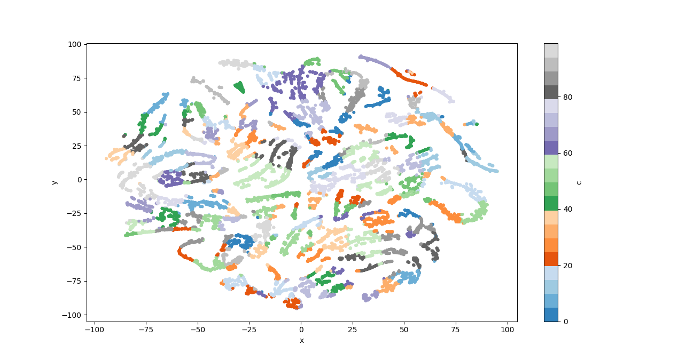

# Generar contestaciones: cómo aprender modelos monolingües especializados que ayuden en contextos con pocos datos

##### Lautaro Martinez

---
### Objetivo

En el presente trabajo, se busca el entrenamiento de un modelo capaz de generar contestaciones a preguntas (o sentencias en general) sin contexto previo.

### Requisitos

Este proyecto fue implementado en Python 3.9 y se requieren las siguientes librerías instaladas para su funcionamiento:

* [Pandas](https://pandas.pydata.org/)
* [Numpy](https://numpy.org/)
* [PyTorch](https://pytorch.org/)
* [Scipy](https://scipy.org/)
* [Scikit-Learn](https://scikit-learn.org/stable/index.html)
* [NLTK](https://www.nltk.org/)
* [GENSIM](https://radimrehurek.com/gensim/)
* [emoji](https://pypi.org/project/emoji/)
* [Sentence-Transofmers](https://www.sbert.net/)

### Dataset

Para el entrenamiento de un modelo, es fundamental contar con un dataset que contenga muchos ejemplos para aprender.
En este trabajo, se utilizó el dataset creado por Mariano Schmidt.
El dataset contiene tweets relacionados a la vacunación contra COVID-19 en Argentina representado en los siguientes campos
|created_at   |id_str   |full_text   |in_reply_to_status_id   |in_reply_to_user_id   |user.id   |
|:-:|:-:|:-:|:-:|:-:|:-:|

donde:

* created_at: contiene la fecha de envio del tweet a la aplicación.
* id_str: contiene el ID especifico del tweet en cuestion.
* full_text: contiene el texto generado por el usuario del tweet.
* in_reply_to_status_id: de existir, contiene el ID del tweet al cual se esta respondiendo.
* in_reply_to_user_id: de existir, contiene el ID del usuario del tweet al cual se estra respondiendo.
* user.id: contiene el ID especifico del usuario que creo el tweet.

El dataset contiene 163.180 tweets en español.

### Hipótesis y consideraciones

El trabajo de entrenar un modelo es arduamente computacional, por lo cual en ciertos momentos recortaremos ciertos ejemplos. Con esto hay que dejar en claro que lo presente se trata de un prototipo muy básico, pero tendrá lo minimo requerido para que podamos tomar conclusiones futuras y realizar predicciones.
Además, como el dataset de entrenamiento esta reducido a un tópico (vacunación contra COVID-19 en Argentina), es de esperarse que el modelo resultante logre un buen rendimiento en predicciones de dicho tópico, y pobre en otros.
Otra caracteristica de este modelo que considero es importante de mencionar, es su desempeño relacionado a la longitud de la pregunta a la cual queremos predecir una respuesta; esto es debido al trabajo con tweets, que cuentan con una longitud máxima de 280 carácteres.

# Proyecto

#### Roadmap

Para lograr el objectivo, se dividirá en proyecto en dos grandes partes:

1) Clustering de respuestas.
En esta primer parte, buscaremos agrupar aquellas respuestas las cuales sean semejantes, desde una dimension estructural hasta semantica.
2) Entrenamiento del modelo.
Con los cluster de respuestas, entrenaremos un modelo por cluster para que aprenda los patrones de las respuestas semejantes. De esta forma esperamos que sea capaz de generar contestaciones bien formuladas acorde a la pregunta.

Esto es lo que esperamos realizar, pero veremos más adelante que deberemos modificar y bajar a otro baseline por ciertas restricciones.
Además, para completar el modelo existiria una tercer parte; aquella que dada una pregunta le asigne un cluster para el cual extraer el modelo que mejor responde dicha pregunta.
Esta parte no sera implementada en el presente proyecto por restricciones de tiempo y debido a que le prestaremos un foco especial a las dos mencionadas previamente que son de mayor interes.

## Etapa 1: Clustering

En esta etapa comenzamos estudiando los datos.
Como se mencionó previamente, se tratan de tweets; esto es particular pues tienen un máximo de 280 carácteres permitidos, de cualquier forma, los usuarios de la plataforma se las han ingeniado para que esto no limite su expresividad. Su solución, los threads.
Para definir los threads, diferenciemos ciertos tipos de tweets:

* **Trigger**: Tweet generado por usuario que *tiene* una o más Answers asociadas.
* **Answer**: Tweet generado por usuario que *es* respuesta a otro tweet.

en nuestro dataset, conocer si un tweet se trata de un Trigger o Answer es muy sencillo; basta con chequear sus campos `in_reply_to_status_id` y `in_reply_to_user_id`. Si estos campos existen, entonces se trata de un Answer y de lo contrario, de un Trigger.

De esta forma, podemos definir los threads de una forma sencilla como el conjunto de un Trigger y todas las Answers de dicho Trigger generadas por el mismo usuario.
Esta definición es muy amplia, y poco real, pero es una buena primer aproximación al caso.
Con los threads, los usuarios logran superar las limitaciones que exije Twitter. Pero hay algo importante de notar aqui, las Answers del Trigger del thread continuan lo que viene exponiendo el Trigger. Es decir, contar con el Trigger y las Answers es equivalente a concatenar el Trigger con las Answers en orden y trabajar con ese único gran Tweet.

> Observación: En Twitter, un Answer puede ser a su vez un Trigger de otras Answers por su estructura de arbol que tiene un sólo tweet. Estos casos no seran contemplados en el proyecto.

Lo mencionado previamente, se trata de nuestro primer paso en el preproceso de los datos; transformar threads en un solo tweet y descartar el Trigger y las Answers que lo componen por separado.

En un paso futuro, para poder agrupar las respuestas, deberemos representar nuestros datos en un vector de varias dimensiones. Mas adelante hablaremos de las distintas caracteristicas (features) que utilizaremos, pero algunas estarán relacionadas con la cantidad de emojis, URLs, hashtags y menciones a otros usuarios, es por ello que podemos, en nuestro preproceso, obtener estos datos para minimizar el tiempo a la hora de vectorizarlos.

De esta forma, nuestro preproceso quedaria conformado por:

* Tratamiento de threads.
* Contar emojis, URLs, hashtags y menciones a otros usuarios.

Todo esto es una tarea pesada computacionalmente, sobretodo el tratamiento de threads que cuenta con complejidad O(n^2) pues por cada tweet debemos recorrer todos los demás para conocer sus atributos. Es por ello que se decidio armar una representación intermedia del dataset original.

De es esta forma, se creo el script `dataset_transform.py` que se encargá de crear un archivo CSV que cuenta con los siguientes atributos:

|id   |tweet   |reply_to_id   |reply_to_user_id   |user_id   |username   |emoji   |url   |hashtag   |is_trigger   |
|:-:|:-:|:-:|:-:|:-:|:-:|:-:|:-:|:-:|:-:|

donde:

* id: idem a id_str en el dataset original
* tweet: idem a full_text en el dataset original
* reply_to_id: idem a in_reply_to_status_id en el dataset original
* reply_to_user_id: idem a in_reply_to_user_id en el dataset original
* user_id: idem a user.id en el dataset original
* username: la cantidad de menciones a otros usuario en el tweet
* emoji: la cantidad de emojis utilizados en el tweet
* url: la cantidad de URLs utilizadas en el tweet
* hashtag: la cantidad de hashtags utilizadas en el tweet
* is_trigger: valor 1 si se trata de un Trigger, 0 caso contrario.

En esta representación intermedia ya fueron tratado los threads, de forma que, ahorramos cálculo repetitivo.

Podemos conciderar lo hecho hasta el momento como un preproceso de los datos, pero notemos que el texto de los tweets presentan irregularidades:

* Tweets mal formateados en el dataset aparece el salto de linea de forma explicita en el texto (`\n`).
* URLs no aportan demasiada información.
* hashtags aportan información pero que se ve demasiado dependiente de la jerga de los usuarios y no es de relevancia en las respuestas.
* emojis, su mayor complejidad recae en su enorme dependencia del contexto. El hecho de no tratarse de palabras, sino más bien de "imágenes" permiten un uso amplio en diversos entornos y culturas lo cual dificulta su significado concreto en el texto.
* Menciones a otros usuarios, en general son nombres válidos precedidos por un '@'.

Para tratar estas irregularidades, se procedió con lo siguiente:

1) Corregir los tweets donde el salto de linea es explicito por un salto de linea real. Pues esa es la intención real del usuario que lo generó.
2) URLs y hashtags reemplazarlos por tokens (`URL_TOKEN` y `HASHTAG_TOKEN` respectivamente). De esta forma mantenemos la información que representan en posición y relevancia, pero no particularizamos cada aparición del mismo. Esto sera importante mas adelante para la vectorización de la palabras.
3) Eliminamos los emojis, su tratamiento es complejo y varía demasiado. Otro camino que puede tomarse hubiera sido reemplazar los emojis por sus palabras, pero esto en muchas situaciones generaba un texto con poco sentido. Si el modelo entrenado final aprendiera esto, tendriamos palabras sueltas que deberiamos post-procesar para suplantarlas por sus emojis correspondientes.
4) Eliminar el @ en la mencion de usuarios. De esta forma tratamos los nombres de usuario como nombres concretos.

> Observación: En una prueba inicial se reeplazaron los emojis por `EMOJI_TOKEN` para evaluar los clusters resultantes y dictaminar que camino elegir al momento de trabajar con ellos.
Los clusters resultantes con `EMOJI_TOKENS` estuvieron muy dispersos en vista del uso de los tokens. Cuando se eliminaban, aquellas respuestas de puros emojis o con gran cantidad permanecieron agrupadas lo cual buscamos efectivamente.

Algo importante que notar es la información que acarrean los URLs, hashtags, menciones y emojis. Cierta parte de esta informacion la perdemos eliminando los emojis, pero ganamos en la simplicidad del preproceso. Ahora bien, hacer lo mismo con URLs y hashtags es muy distinto y contraproductivo.
En una respuesta, podemos diferenciar su tipo; lo cual es muy dependiente de las componentes de la respuesta. Miremos el siguiente ejemplo

- *Andá a leer shorturl.at/hnyLO por favor!*

podemos calificarlo como informativo, el usuario que escribió el texto búsca que el que lo reciba, lea la información presente en el link.
Veamos como el tipo cambia drasticamente si removieramos las URLs:

- *Andá a leer por favor!*

El resultado es una respuesta que muchos calificamos como insulto/hiriente, pues trata al que lo lee de ingenuo en el tópico que se discute.
Con este ejemplo simple, podemos ver la importancia que tienen en concepto de información que acarrean los componentes como URLs, hashtags y emojis.

Para manejar todos estos tweets y el preproceso que cada uno conlleva, se creo el script `Tweet_utils.py`, el cual contiene la clase Tweet donde se guarda información de la representación intermedia del dataset y contiene el método `process` para llevar a cabo el preproceso descripto anteriormente.

Ya con los datos procesados, y tweets preprocesados; podemos seguir con la parte más importante de este proyecto.

#### Seleccion de características (features)

Como dijimos previamente, el objetivo de esta etapa es agrupar respuestas semejantes, esto es:

* Desde un lado estructural, uso de links, emojis, hashtags, mencion a otros usuarios, su longitud y relación con la pregunta.
* Desde un lado de contenido, la semántica de la respuesta.

##### Iteración #1

Para ello, en una primer iteración del clustering se utilizaron las siguientes caracteristicas:

* Longitud del Trigger
* Longitud del Answer
* Cantidad de emojis usados en el Trigger
* Cantidad de emojis usados en el Answer
* Cantidad de hashtags usados en el Trigger
* Cantidad de hashtags usados en el Answer
* Cantidad de menciones en el Trigger
* Cantidad de menciones en el Answer
* Cantidad de URLs usadas en el Trigger
* Cantidad de URLs usadas en el Answer

Notar que todas estas features son puramente estructurales. Los clusters resultantes fueron buenos en este sentido. Se encontraron clusters con exclusivo uso de emojis o urls, además de clusters donde las respuestas eran largas, medianas o cortas.
De cualquier modo, esto no satisface el objetivo pero es una buena primer aproximación.

##### Iteración #2

En una segunda iteración se quiso acercar mas las respuestas por su contenido. Para ello, una solución sencilla fue utilizar los Word Embeddings de las palabras que conforman el Trigger y el Answer utilizando asi las features:

* Utilizadas en Iteración #1
* Embeddings de 300 dimensiones de las palabras del Trigger
* Embeddings de 300 dimensiones de las palabras del Answer

Para obtener un unico vector que represente a todas las palabras, se realizo una suma vectorial de cada vector individual.

Con estas features, obtuvimos clusters muy similares a los actuales del proyecto.
Se mantienen clusters con emojis y URLs aunque ahora un poco más mezclados entre ellos. Clusters que mencionan a un usuario por ser una respuesta directa al Trigger estan cercanos gracias a los embeddings utilizados donde priorizamos las palabras utilizadas y su contexto en la sentencia.

> El código para realizar clustering se extrajo de un trabajo previo realizado. El algoritmo de clustering utilizado se trata del K-Means donde se le debe proveer una distancia a utilizar.
En el código original se utilizó mediante la distancia coseno, arrojando los siguientes clusters en nuestra busqueda de asemejar respuestas:

> Aqui las respuestas en un mismo cluster son del mismo color.
Notar como todos se encutran dispersos en la imágen. Podemos "dibujar lineas" con los elementos del mismo cluster viendo asi la distancia coseno.
Cambiando a una distancia euclidea, se obtuvieron clusters más compactos y efectivos:

##### Iteración #3

En esta última iteración se quiso utilizar una feature que permita relacionar fuertemente el texto del Trigger y el texto de la Answer; esta relación de, "respuesta a pregunta".
Para ello, se utilizó la [métrica BLEU](https://es.wikipedia.org/wiki/BLEU).
Esta métrica toma dos sentencias y retorna un valor en [-1, 1] siendo que un valor más grande expresa gran relación de similitud entre las dos sentencias de entrada.
Notar que es una métrica de similitud, pero nos es suficiente para obtener la relación buscada, pues generalmente la respuesta a una pregunta es similar en tópicos estructurales.
La métrica BLEU es altamente utilizada por ello en la evaluación de traducciones.
De esta forma, las features utilizadas fueron:

* Utilizadas en iteracin 2
* Métrica BLEU

Los clusters resultantes de esta iteración no tuvieron una diferencia abismal con respecto a la iteración previa descripta. Pero si se observaron que respuestas con mayor similitud en cuanto a la expresión del usuario estuvieron más agrupadas; lo buscado en nuestro clustering.
Es por ello que optamos éste método de clustering, y no otro, para el avance al entrenamiento de un modelo capaz de generar contestaciones.

###### Inspección de clusters

Todos los clusters de esta última iteración se encuentran disponibles en: *Resultados/clusters.txt*
Si bien se cuentan con 100 clusters, haremos algunas distinciones y menciones sobre algunos de ellos.

> Motivo por el cual se utilizaron 100 clusters fue por un valor 0.72 de puntaje de métrica Silhouette. Un valor mayor a 0.7 es conciderado aceptable.
Al incrementar los clusters la mejoría no era significante en el puntaje; al disminuir, el puntaje disminuía drásticamente.

Cluster 1:

- @spitta1969 Tuit del mes Spitta
- @spitta1969 No tienen escrúpulos, para ellos esta bien, nunca lo van a entender.
- @rquiroga777 Como podes poner de ejemplo a ese cararaduraHDP que se  esta haciendo su campaña escribiendo lindo .Fue Mtro d Salud rompió el Ministerio , venció miles de VACUNAS .
- @ernestorr @Argentina_Duda Bueno es lógico que Sabri diga eso... es vieja y nadie la quiere pinchar Jajaaa  Perdón.
- @ernestorr + de 100 mil aplicaron en 10 días pero ñañaña
- @ernestorr @Mpp_949 Argentina, país donde las papasfritas opinan de ciencia.
- @spitta1969 alguien me puede explicar xq compraron la vacuna más cara?
@NicoOlsze No es necesario ser de derecha para darse cuenta de qué vacunación es parte de lo funcional del gobierno y qué vacunación es de puro privilegio.
- @NicoOlsze El código Penal dice esto. No es para celebrar sino para demandar Le sustrae una posibilidad de vida a un adulto mayor que la merece. https://t.co/FW4ws8xeTf
- @spitta1969 Soy personal de salud me puse las 2 dosis +de 60, con problemas de salud es difícil la situación no hay opciones
- ...

Este cluster cuenta con respuestas con muy baja tasa de emojis en sus sentencias y menos de 10 URLs en total en todo el cluster.
Lo interesante de este cluster es el tópico que concentran; la gran mayoría son respuestas de desprestigio y enojo.

Cluster 4:

- @spitta1969 @cami_bonino En campaña una vez dijo: "La Argentina de los vivos se terminó". Un pedazo de sorete mal cagado son!
- @spitta1969 #EsAhora  Habría que instalar este #.... No me alcanza el pinet Salir y que entiendan que no va más !!!!
- @spitta1969 Lo bueno Sandra es que estamos viendo un ensayo en fase 1 en vivo.. son todas ratas inoculadas!
- @ernestorr No soy experta @ernestorr pero en mayores de 60 con riesgo y de 18 a 59 con riesgo quiero q se aplique dosis completas y a los dias q corresponde la 2da dosis. No se puede jugar con la vida de los q somos y me incluyo de riesgo  Perdi 2 fliares no qro ser la 3ra.. Con jovenes si!
- @ernestorr Tengo familia en España, y solo se vacuno una prima joven, porque trabaja en Salud. Tías, Tíos y demás familiares Mayores y de riesgo, esperan por su dosis... Acá ya se está dando a Nuestros Mayores y Docentes. Miremos lo que avanzamos en Vacunación. Hay más de 4.000.000 de dosis
- @ernestorr cada vez que la leo pienso "qué resentida". también pienso que, si el que votó ella hubiera ganado y traído estas vacunas (muy contrafáctico lo mío, porque nunca hubiese hecho ni lo uno ni lo otro), serían para ella lo mejor del mundo. en fin.
- @ernestorr Soy profesor de pensamiento político, creo que se como desarrollar una vacuna.  Igual cuál sería el problema si es tecnología vieja? La salk tiene 60 años y logra erradicar la polio si vacunas lo suficiente
- @NicoOlsze El orden considera la carga viral a la que están expuestos los trabajadores y riesgo de vida por claras cuestiones fisiológicas. Es una cuestion ética, si un político de 20 a 50 años accede a una dosis sin ser factor de riesgo, saltándose lugares es un falta de respeto. https://t.co/SQLEQTgfsc
- @spitta1969 ningún científico bancado con fondos públicos puede tener una opinión distinta de lo que dicta el amado líder, o será considerado terrorista. Si no se consigue la sumisión, es evidente que algo falla en el Stasi científico. Se recomienda acusar de antivacuna, terraplanista, etc https://t.co/NfVInfvjxk
- @spitta1969 @spitta1969 podria ocupar un cargo c toma de decisiones en salud y ahorrar un monton de sueldos de cientificos politicos militantes que creen en la cura del empacho c cinta ! Ni menguele se atrevio a tanto militando el experimento ruso kirchnerista!
- ...

Al igual que el anterior, la utilización de emojis y URLs en este cluster es ínfima.
Lo que llama la atención es que si uno inspecciona detenidamente, la gran mayoría de las respuestas contienen un insulto. Esto es insólito pues nunca concideramos utilizar la cantidad de insultos como feature en nuestro clustering, sin embargo, este hecho fue capturado levemente con las features utilizadas dando como resultado este curioso cluster.

Cluster 11:

- ...
- @spitta1969 En 🇺🇾 compraron Pfizer, Synovax y COVAX, ya tienen toda la logística armada y los vacunatorios prontos. Las personas se vacunarán luego de anotarse en una página del gobierno según edad, comorbilidades,etc. Sólo temen que los lab no entreguen a tiempo como está pasando  en el 🌎.
- @FabBallarini @jmcos Asi es ... Soy médica de htal del GCBA ...vacunada hace 72 hs...tanto mis compañeros como yo estuvimos y estamos muy bien ...💪😷🤩
- @spitta1969 El personal de salud siempre va a estar primero.  Del resto de la sociedad, los que corren más riesgo. En este caso son los mayores de 60 o con comorbilidades.  Si el riesgo fuese para todos por igual, sería discutible.
- @spitta1969 Gobiernan los montoneros
- @EquipoBanquemos @spitta1969 @fpedrosa2 @RicBenedetti @BanquemosJ
- @juvebanquemos @BanquemosA @BanquemosAR Por favor, únanse con otros opositores...estás facciones opositoras de poca incidencia no hacen más que fortalecer al FdT para perpetuarse. Los banco pero necesitamos ser más fuertes que ellos y si nos dividimos no lograremos que se vayan 🙏🙌
- @norabar El equipo del gobernador de la pcia de Bs As de Axel Kicillof está muy organizado con la vacunación. CABA un desastre.
- @norabar Uds esperen que se están vacunado los amigos de todos estos hdrmpqlp políticos que nos gobiernan , que asco que dan !!!
- @norabar un poco tarde se acordaron. en provincia en enero ya te podías  registrar. yo me registré el 22
- @norabar Y para qué te querés anotar si no hay vacunas pedazo de pelotuda, Ya que estás, te anotaste para el próximo viaje a Júpiter?
- @norabar Y pensar que pasan estas cosas y tu ministro reservó 3000 para sus amigos.
- ...

Este cluster, con características similares al anterior en cuanto al uso de emojis y URLs, concentra tópicos de la adquisición de vacunas contra COVID-19, como tambien expresiones de los usuarios de adquirirla o no. 

Cluster 19:

- @spitta1969 Con las 2 cosas nos hizo mierda!!!
- @AnaThevenin @spitta1969 Abra que nombrar uno por uno en cada municipio a los vacunados vip y que la gente decida cómo tratarlos.
- @spitta1969 No salen del relato para sus fieles, los demás no interesan. Ésta foto es de Chaco, así cuidan a la gente! https://t.co/B6AJegmNwr
- @rquiroga777 @ElvisFern2 No seamos ingenuos. Ahora, en vísperas de elecciones, van a hacer todo lo posible para apagar la (débil pero creciente) producción económica. No sería raro que ahora exijan confinamentos y prohibiciones estrictas.
- @rquiroga777 Restringir a fondo implica que ni un solo camión pase la frontera. Eso no se hizo ni en los momentos más duros de la cuarentena. Económicamente sería desastroso y posiblemente tenga consecuencias de desabastecimiento en insumos críticos.
- @ernestorr @ajmechet sigo sin entender como alguien llega a preferir la operación política antes que la salud de la comunidad... te juro que no lo entiendo.
- @ernestorr Además "Tecnología vieja", como si la vacuna fuera un iPhone, ahora hay que tener todos la nueva de mRNA porque es la más cool. Que gente estúpida.
- @ernestorr Tampoco le pidamos mucho a la pobre mujer que ni sabe escribir. Me conformo si no promociona cds y se no se cura con el Ravi Shankar como el mamerto
- @ernestorr Es tan intensa q parece pirada, aunque supongo q provoca para q le den identidad los q responden o retwitean. Ya la he leído tomada en otro twitter
- @spitta1969 Tengo una duda. Ya recibieron ambas dosis, o tal vez tenemos suerte y lo vip les quedo a mitad de camino?
- ...

En este cluster la utilizacion de emojis es practicamente nula. Muy pocos URLs.
Las respuestas se concentran en el tópico de Vacunacion VIP, poleéica generada con el ingreso de las primeras vacunas a Argentina

Cluster 28:

- @ernestorr 🤣👏😂👏😏
- @ernestorr 👏👏👏👏😎😂🤣
- @ernestorr La masa!
- @mmbarrionuevo Que oportuno
- @ernestorr https://t.co/Nhn2oHx7xZ
- @ernestorr 🤣🤣🤣🤣🤣🤣🤣
- @ernestorr Platillos 😂
- @ernestorr Sinopharm?
- @ernestorr https://t.co/S8cYLj5Pfg
- @ernestorr 😞
- @ernestorr 💔
- @ernestorr 💔
- ...

Este cluster concentra respuestas con gran porcentajes de emojis en su composición.
Como mencionamos antes, en iteraciones previas los clusters de emojis estuvieron mejor agrupados, pero sacrificamos este hecho para obtener respuestas similares aún más agrupadas.
Este cluster se encuentra mezclado levemente con respuestas que contienen URLs unicamente motivo de lo antes mencionado.
Notar de que estamos mostrando las 10 primeras respuestas de los clusters y pareceria que se tratan de clusters que agrupan las respuestas a un solo tweet, pero se incita a revisar los clusters completos para ver que esto no es asi. Simplemente estan ordenadas por el orden de vectorización.

Cluster 29:

- 🚩Por provincia (notificados hoy/acumulados) 👇 https://t.co/IfDDJRqrLw
- @RubinsteinOk https://t.co/BYl21aQlLH
- @RubinsteinOk https://t.co/9yYNOt98Kw
- @RubinsteinOk https://t.co/rkCuXh9Zni
- @RubinsteinOk https://t.co/1i7BW6vOak
- @RubinsteinOk Ah pero Chile...
- @msalnacion @Jewlian43 Vergüenza
- @msalnacion Faltan algunas... #GobiernoDeInutiles https://t.co/YsS5YOdV0b
- @ernestorr 👏👏👏👏👏
- @norabar Cual vacuna 1 dosis o 2?
- ...

Este cluster, similar al anterior, concentra todas las respuestas que estan compuestas únicamente con URLs. Otras respuestas de este tipo se encuentran mezcladas en el Cluster 28.
Entre sus respuestas, tambien se encuentran respuestas cortas con menos de 8 palabras en promedio.
Esto es interesante pues podemos ver que al igual que ocurre en el cluster anterior, las respuestas cortas suelen utilizar emojis o URLs en su composición.
Los demás clusters sin tantos emojis y URLs concentran respuestas medianas a largas.

Cluster 75:

- @rquiroga777 @alferdez @Kicillofok @carlavizzotti @nkreplak es urgente, volvemos  un año atrás,  marzo 2020.
- @_IPNoticias @mmbarrionuevo @maxilegnani @piaslapka @AnitaSicilia Peor aún x que  la sputnik necesita una cadena de frío de -20 grados . No se puede transportar en una conservadora.
- @_IPNoticias @mmbarrionuevo @maxilegnani @piaslapka @AnitaSicilia Me llama la atención la periodista  que hablo recién del patriarcado de la corona bitranica cuando la reina madre es mujer, increíble 🤦🏻
- @ginesggarcia @msalnacion Gordo la concha de tu peronista hermana, hijo de putas
- @ginesggarcia @msalnacion Pero salió todo mal? No hagamos propaganda de esto!!!
- @julipavicic @rquiroga777 @NicoOlsze @ernestorr @norabar @FabBallarini ¿Otra vez el charlatán ese? ¿No aprendió su lección con la Sputnik? Son perseverantes, hay que reconocerles eso.
- @radiolared @RubinsteinOk @fabdoman Hay que tener cara de piedra...
- @MatiasSmz @norabar @plenque @sole_reta @jorgeluisaliaga @mmbarrionuevo
- @rquiroga777 @FlorBallarino de donde salen esos datos? estan actualizados en algun lado con el segundo envío de 220k dosis?
- @msalnacion @InjuveArg Hagan uno que sea #adultecesresponsables xq el bardo siempre lo tienen lxs pibxs pero lxs adultos tmb hacen cualquiera
- @Ar_Unida @ANMATsalud @msalnacion Vayan a usar de conejitos de indias a los rusos. Que se vacunen todos ellos primero. @ComunidadMitre
- ...

En este cluster se concentran las respuestas que hacen varias menciones a distintos usuarios en la red social.
Se tratan de respuestas largas, pero no parecen concentrar ninguna similitud en comun más alla de las menciones, aparte de ser respuestas demasiado directas a los mencionados.
Hipotizo que este cluster se trata de un cluster de mala calidad para los objetivos del proyecto pues el modelo que aprenda a partir de esto no generara buenas contestaciones a preguntas generales indirectas.

> 
Plot de clusters con distancia coseno

Plot de cluster con distancia euclidea. Clusters más compactos.

Asi concluye la Etapa 1 de clustering de respuestas similares.

En el archivo `Clustering_utils.py` se encuentran funciones para clusterizar, plotear clusters y guardar los resultados.
En el archivo `WordEmbeddings.py` se encuentra la funcion para obtener el modelo de Word2Vec para obtener los embeddings de las palabras de 300 dimensiones.

## Etapa 2: Entrenar un modelo

Esta segunda etapa es fundamental al objetivo del proyecto. Queremos *entrenar* un modelo capaz de *generar* contestaciones.
Pero esto supone muchas dificultades a la hora de llevar a la practica:

1) No se cuenta con gran procesamiento suficiente para entrenar un modelo desde cero.
2) No se encuentra ni remotamente con la cantidad de datos necesarios para entrenar un modelo desde cero.

Este último punto se ve aún más afectado por el hecho que deseamos entrenar un modelo por cluster. Es decir, ni siquiera contamos con todos los pares de Trigger y Answer del dataset para entrenar un modelo.

A raíz de lo expresado, la decision tomada fue de **bajar el baseline**.
Si bien nuestro objetivo era *entrenar* un modelo para *generar* contestaciones; podemos *fine-tunear* un modelo para contestar.

Con este nuevo objetivo en mente se comenzó a buscar un modelo para fine-tunear y esto supuso muchos obstaculos.
Claramente buscamos un modelo [Seq2Seq](https://en.wikipedia.org/wiki/Seq2seq), que nos permita convertir una secuencia de entrada (Trigger) a una de secuencia de salida (Answer). Así el modelo aprende como transformar una secuencia en otra, en nuestro caso: como transformar una pregunta en una respuesta.
Al buscar modelos para fine-tunear con nuetro objetivo, se encuentran una amplia variedad de posts, papers y proyectos armados de como fine-tunear un modelo para contestación de preguntas *en contexto*, y esto es fundamental.
Nuestra tarea es fine-tunear un modelo en contestación a preguntas **sin contexto**.
En la contestación con contexto, se entrena el modelo dando como input un documento, una pregunta cuya respuesta se encuentra **en el documento**, y los índices de comienzo y terminación de la respuesta a la pregunta en el mismo.
Esto es para nada viable con nuestro objetivo; nuestros Triggers no contienen las Answers buscadas, pues estas son generadas por usuarios.

Esto supuso un grado mayor de dificultad para encontrar un modelo que fine-tunear con nuestros objetivos.

Otro camino que se intentó fue el de fine-tunear un chatbot.
Si lo pensamos con detenimiento, un chatbot recibe un Trigger y devuelve un Answer sin contexto.
El problema con esto, es la gran dificultad que supone fine-tunear un chatbot además de la escaces de ejemplos que contamos.

Finalmente luego de lectura de varios posts en distintas paginas, se tomo un paso atrás para cambiar la estrategia de busqueda.
Un tiempo atrás se habló de SBERT o sentence-bert, el cual es una modificación al modelo pre-entrenado BERT que utiliza red siamesa y triplet.
En el [paper](https://arxiv.org/abs/1908.10084) presentado se establece que se puede obtener un valor semántico de las sentencias y luego compararlas con la distancia coseno.

> Si bien esto se puede hacer con BERT, SBERT presenta una eficacia mayor en esta tarea.

Con SBERT en mente, se siguió leyendo posts sobre el modelo y se encontró la siguiente publicación: [How to Fine-Tune Sentence-BERT for Question Answering](https://www.capitalone.com/tech/machine-learning/how-to-finetune-sbert-for-question-matching/)

Este proyecto tiene como objetivo, dada una pregunta, asignarle una única respuesta.
Lo que relaiza la autora del post es fine-tunear SBERT con un **conjunto de preguntas similares** y una respuesta común a todas ellas, para luego inferir en base a la pregunta dada por el usuario a cúal se asemeja más para asignarle la respuesta de ese grupo.

En nuestro proyecto; el conjunto de preguntas similares es unicamente el Trigger y la respuesta, Answer.

> Notar que de esta forma tendremos muchas preguntas iguales con distinta respuesta. Esto no es un problema pues el modelo aprende a comparar preguntas únicamente.

De esta forma conseguimos fine-tunear SBERT para nuestro nuevo objetivo de forma exitosa.

### Desempeñoo del modelo

Como expresamos previamente, nuestro objetivo es fine-tunear un modelo por cluster.
En esta sección, veremos el desempeño de solo uno de estos modelos para no volver engorroso el informe.
Asi, de cierta formas estamos asumiendo que los modelos tendran un desempeño equivalente entre ellos, lo cual no es del todo cierto pues dependen del cluster con el que fueron fine-tuneados; ciertos tipos de preguntas son mejor respondidas por modelos que aprendieron de clusters con su patron correspondiente de respuesta; pero servirá como guía de como evaluar los demás clusters.
De cualquier forma, en próximas secciones compararemos las respuestas de distintos modelos para asegurar esta hipotesis.

##### Métrica

Para evaluar la eficiencia del modelo fine-tuneado utilizamos la misma métrica BLEU utilizada en la Etapa 1 de clustering.
Con esta métrica, compararemos las respuestas que posee un Trigger del conjunto de evaluación del fine-tuneo del modelo, con la respuesta que induce el modelo.
Esta métrica representará cuanto se asemeja la respuesta del modelo en contraste de las respuestas reales que contiene el Trigger.

#### Desempeño del modelo de cluster 2

Veamos entonces el desempeno del tercer cluster (fue una elección aleatoria).
Se tomaron seis Triggers del conjunto de evaluación del modelo junto a sus respectivas respuestas para la posterior evaluación con la métrica previa mencionada.
Notar que el modelo nunca vio el Trigger, ni las respuestas en su etapa de fine-tuneo presentes en el conjunto de evaluación.
El siguiente cuadro, la primer columna es el Trigger, la segunda la respuesta del modelo, y la tercer el valor de la métrica.

|                                                                                                      Trigger de evaluacion                                                                                                     |                                                                                                                                                      Answer de modelo                                                                                                                                                      | Metrica |
|:------------------------------------------------------------------------------------------------------------------------------------------------------------------------------------------------------------------------------:|:--------------------------------------------------------------------------------------------------------------------------------------------------------------------------------------------------------------------------------------------------------------------------------------------------------------------------:|:-------:|
| Monitor Público de Vacunación 15-03 2.488.218 dosis aplicadas Con una dosis 2.022.489 personas (4,46%) Con ambas dosis 465.729 personas (1,03%) https://t.co/UdXXPTrG3x Dosis aplicadas y distribuidas https://t.co/aQ2utO8man | @DanteForesi @_albertista_ @msalnacion Manda los nombres de los 13.000 "estratégicos", please                                                                                                                                                                                                                              |  0.126  |
| La ciencia es la única salida.    Aguanten las vacunas                                                                                                                                                                         | @FabBallarini Es una huevada, pero tendríamos que entender que, en este virus, EL MOSQUITO (vector) SOMOS NOSOTROS. Y cuidar a los otros, no sólo a nosotros mismos.                                                                                                                                                       |   0.26  |
| Ni loco me la pongo, andá a saber que le ponen https://t.co/trhvKTreVs                                                                                                                                                         | @NicoOlsze Este hijo de puta todavía da clases de cómo vacunar                                                                                                                                                                                                                                                             |   0.55  |
| Xq le siguen preguntando a @RubinsteinOk algo?                                                                                                                                                                                 | @julianguarino @RubinsteinOk @C5N Y que convirtio el Ministerio de Salud en un Edificio vacío en donde nunca se ocuparon de la población. Comi es posible tal lamida de botas de parte suya? Y ademas no importan sus titulos importa su gestión, que fue deficiente e inmoral y Ud alaba eso? Realmente da asco.          |   0.35  |
| Me estoy haciendo un poco hincha de River.                                                                                                                                                                                     | @hitchpster @rquiroga777 @ernestorr Es un mecanismo conocido como pasaje transplacentario de inmunoglobulinas, sobre todo del tipo IgG, el feto recibe los anticierpos que provienen de la sangre materna, tanto los protectoress para el RN como los que pueden causarle daño. Esto continua con el calostro y lactancia. |   0.43  |
| Descubrieron un árbol petrificado en Lesbos de entre 17 y 20 millones de años de antigüedad 👇 https://t.co/e7LXOTnu0D                                                                                                          | @NicoOlsze Este hijo de puta todavía da clases de cómo vacunar                                                                                                                                                                                                                                                             |  0.083  |

Se seleccionaron 3 Triggers relacionados al tópico del dataset, de vacunas en Argentina; y 3 Triggers que no compartían el tópico del dataset general.
Notar que las métricas obtenidas no fueron muy positivas, un solo Trigger de los seis superó el 0.50 de BLEU. Además, 2 respuestas fueron similares para dos Triggers completamente distintos.
Las respuestas de los tres primeros Triggers con respecto a la vacunación obtuvo valores bajos, y las respuestas, salvo en el ultimo, no tienen mucho sentido en base al Trigger.
El curto Trigger podemos ver como se hace mencion a un usuario y cuya respuesta es, entre otros, dirigido a este mismo usuario aunque la respuesta no tenga mucho sentido con el Trigger.
El quinto Trigger cuenta con un valor de metrica elevado, pero la respuesta no tiene sentido en base a la pregunta.
Aquí podemos ver como el modelo se desempeña frente a Triggers fuera del tópico de vacunación junto con el sexto Trigger; éste último cuenta con el valor más bajo en la métrica y una respuesta nada satisfactoria.

### Comparación de Modelos

En nuestro roadmap, nuestra meta fue entrenar un modelo por cluster. Luego de los acontecimientos nombrados, nos quedamos con fine-tunear un modelo por cluster.
Ahora bien, que sucedería si fine-tuneamos un único modelo con **todos** los clusters; o por otro lado, como se desempeñaría SBERT, nuestro modelo base, ante la tarea de responder estas preguntas?

Este es el objetivo de esta sección, evaluar el desempeño de estos distintos caminos que se pudieron haber tomado, para una conclusión final.

Propondré 6 preguntas, algunas relacionadas al tópico del dataset y otras no, que no se encuentran en el dataset siquiera, para estudiar cuan acertada son las respuestas de los modelos.
Al final de todo, eso es lo que importa: Qué tan fuerte es la relación de respuesta entre la entrada y la salida?
Aquí es claro que la métrica antes propuesta no es valida, por lo que haremos una evaluación a "ojimetro" (la cual debería ser en muchos de los casos la mejor métrica para este tipo de tarea).

> Por limitación de cómputo se fine-tunearon 4 modelos con un cluster distinto y 1 modelo con 10 clusters juntos que representará al modelo fine-tuneado con **todos** los clusters.

| No. |                     Trigger                     |                                                                                                                                            Modelo 0                                                                                                                                           |                                                                                                                                            Modelo 1                                                                                                                                            |                                                                                                                                            Modelo 2                                                                                                                                            |                                                                                                                                                Modelo 3                                                                                                                                               |                                                                                                                                          Modelo Todos                                                                                                                                          |                                                                                                                                             SBERT                                                                                                                                             |
|:---:|:-----------------------------------------------:|:---------------------------------------------------------------------------------------------------------------------------------------------------------------------------------------------------------------------------------------------------------------------------------------------:|:----------------------------------------------------------------------------------------------------------------------------------------------------------------------------------------------------------------------------------------------------------------------------------------------:|:----------------------------------------------------------------------------------------------------------------------------------------------------------------------------------------------------------------------------------------------------------------------------------------------:|:-----------------------------------------------------------------------------------------------------------------------------------------------------------------------------------------------------------------------------------------------------------------------------------------------------:|:----------------------------------------------------------------------------------------------------------------------------------------------------------------------------------------------------------------------------------------------------------------------------------------------:|:---------------------------------------------------------------------------------------------------------------------------------------------------------------------------------------------------------------------------------------------------------------------------------------------:|
| 1.) | La Sinopharm es una vacuna muy buena!           | @norabar @nytimes ¿No tienen DNI pero les van a escanear la marca de la vacuna                                                                                                                                                                                                                | @norabar La que no es apta para mayores de 60? Que curioso, vacunan a todos los chicos de la campora x izquierda, a los docentes que son población joven y no vacunan a los viejos que son los que mas mueren. Querrán pagar menos de jubilaciones? Se robaron las vacunas ni olvido ni perdón | @norabar La que no es apta para mayores de 60? Que curioso, vacunan a todos los chicos de la campora x izquierda, a los docentes que son población joven y no vacunan a los viejos que son los que mas mueren. Querrán pagar menos de jubilaciones? Se robaron las vacunas ni olvido ni perdón | @norabar La que no es apta para mayores de 60? Que curioso, vacunan a todos los chicos de la campora x izquierda, a los docentes que son población joven y no vacunan a los viejos que son los que mas mueren. Querrán pagar menos de jubilaciones? Se robaron las vacunas ni olvido ni perdón        | @norabar La que no es apta para mayores de 60? Que curioso, vacunan a todos los chicos de la campora x izquierda, a los docentes que son población joven y no vacunan a los viejos que son los que mas mueren. Querrán pagar menos de jubilaciones? Se robaron las vacunas ni olvido ni perdón | @norabar Y nosotros les compramos la vacuna...bien ahí...🤦♀️                                                                                                                                                                                                                                   |
| 2.) | Cual es la vacuna mas efectiva?                 | @FabBallarini Es una huevada, pero tendríamos que entender que, en este virus, EL MOSQUITO (vector) SOMOS NOSOTROS. Y cuidar a los otros, no sólo a nosotros mismos.                                                                                                                          | @ernestorr Seguro van a decir que Praga pertenece a la Unión Soviética.                                                                                                                                                                                                                        | @norabar En muchos https://t.co/fvlPf289CR nececitan vacunarse, ya tienen inmunidad.                                                                                                                                                                                                           | @rquiroga777 Yo no se qué ven. Los casos bajan solos desde hace meses y suben solos. Por ejemplo en este gráfico se aprecia la MISMA suba de casos por la que querían implementar toque de queda en Enero, y la misma bajada repentina por la que no dijeron nada luego. No hay nada especial aquí.   | @ernestorr Seguro van a decir que Praga pertenece a la Unión Soviética.                                                                                                                                                                                                                        | @NicoOlsze Este hijo de puta todavía da clases de cómo vacunar                                                                                                                                                                                                                                |
| 3.) | Vacunas aprobadas por el Gobierno               | @NicoOlsze Este hijo de puta todavía da clases de cómo vacunar                                                                                                                                                                                                                                | @spitta1969 Que empatica que sos, te faltó poner que se las aplique al mejor postor. Das mucha pena                                                                                                                                                                                            | @spitta1969 Que empatica que sos, te faltó poner que se las aplique al mejor postor. Das mucha pena                                                                                                                                                                                            | @rquiroga777 A mi madre le llegó el domingo por la tarde y a mi tía también por suerte pero intenté hacer un blanqueo del pin y el mensaje no me llega al celular por más veces q lo intento, el número de atención telefónica me dá una casilla de msj de Claro a la q no se le pueden dejar más msj | @norabar Que alegría enorme❣️, gracias! Volverán los abrazos con mis viejitos🥰                                                                                                                                                                                                                  | @spitta1969 Que empatica que sos, te faltó poner que se las aplique al mejor postor. Das mucha pena                                                                                                                                                                                           |
| 4.) | Donde vacunarse                                 | @norabar @nytimes ¿No tienen DNI pero les van a escanear la marca de la vacuna?                                                                                                                                                                                                               | @NicoOlsze Y que más tenía escrito?  Vas a kirchnerear esta pelotudez?                                                                                                                                                                                                                         | @spitta1969 Que empatica que sos, te faltó poner que se las aplique al mejor postor. Das mucha pena                                                                                                                                                                                            | @spitta1969 Los creyentes sin papeles ahora deberían preguntar:   ALGUIEN PUEDE PENSAR EN PUTIN?                                                                                                                                                                                                      | @spitta1969 Creo que el solo hecho que pase el tiempo, nos permitirá ver la magnitud de la corrupción a la que pueden llegar, así como la ineptitud más flagrante para administrar el país. Esperemos peores cosas, porque no van a poder mejorar nada. Son esto que estamos viendo.           | @norabar @nytimes ¿No tienen DNI pero les van a escanear la marca de la vacuna?                                                                                                                                                                                                               |
| 5.) | El aluminio refleja la luz                      | @spitta1969 @agueroangel No se si es un buen profesional, pero como político da https://t.co/rMLfTJAkGL presentó como candidato a intendente de mi municipio, y no le vimos la cara en toda la campaña, ni siquiera apareció, o aparece, como concejal, y en este momento podría hacer mucho. | @spitta1969 @agueroangel No se si es un buen profesional, pero como político da https://t.co/rMLfTJAkGL presentó como candidato a intendente de mi municipio, y no le vimos la cara en toda la campaña, ni siquiera apareció, o aparece, como concejal, y en este momento podría hacer mucho.  | @spitta1969 @agueroangel No se si es un buen profesional, pero como político da https://t.co/rMLfTJAkGL presentó como candidato a intendente de mi municipio, y no le vimos la cara en toda la campaña, ni siquiera apareció, o aparece, como concejal, y en este momento podría hacer mucho.  | @spitta1969 @agueroangel No se si es un buen profesional, pero como político da https://t.co/rMLfTJAkGL presentó como candidato a intendente de mi municipio, y no le vimos la cara en toda la campaña, ni siquiera apareció, o aparece, como concejal, y en este momento podría hacer mucho.         | @rquiroga777 Es un SORETE, aparte de un ignorante contumaz. Y si no, un cínico hijo de puta, ya que si sabe cómo se da clases en Nivel Inicial y Primario y las DIMENSIONES de las aulas de jardines y primarias PRIVADAS, no debería NI HABLAR de “abrir las escuelas”... ¿Sabe, entonces?    | @spitta1969 @agueroangel No se si es un buen profesional, pero como político da https://t.co/rMLfTJAkGL presentó como candidato a intendente de mi municipio, y no le vimos la cara en toda la campaña, ni siquiera apareció, o aparece, como concejal, y en este momento podría hacer mucho. |
| 6.) | Parakfe mabda majefs dmaif aionadiuvn sadf didi | @radiolared @RubinsteinOk @fabdoman Ex Secretario! Hablemos con propiedad                                                                                                                                                                                                                     | @spitta1969 Demencial                                                                                                                                                                                                                                                                          | @spitta1969 Tuit del mes Spitta                                                                                                                                                                                                                                                                | @spitta1969 Por algo nadie se anima a un debate abierto sobre vacunas. De hecho se ridiculiza , rotulados Anti ciencia, peligrosos, hippies, y nombrados por la OMS ( dependiente de la Org. mundial del comercio) como el 4to motivo de propagación de enfermedades. Se le dedica las tiempo a....   | @spitta1969 https://t.co/lND8qDYrBz                                                                                                                                                                                                                                                            | @radiolared @RubinsteinOk @fabdoman Ex Secretario! Hablemos con propiedad                                                                                                                                                                                                                     |

En las preguntas contamos con:

* 4 preguntas relacionadas al tópico del dataset, la vacunación contra COVID-19 en Argentina.
* 1 pregunta con tópico dramáticamnente diferente al anterior.
* 1 pregunta sin sentido alguno.

Importante notar que aquí veremos que tan buenas son las respuestas a las preguntas dadas, pero lo crucial que realiza el modelo el asemejar la pregunta de entrada con una que conoce; este dato se puede chequear en los archivos *Model/Resultados/predicciones_0| 1| 2| 3| base| top_10*.
En el siguiente cuadro, califico las respuestas con:

* MALA: respuesta sin sentido aparente con la pregunta realizada.
* REGULAR: respuesta con sentido pero con necesidad de contexto.
* BUENA: respuesta con sentido a la pregunta, quizá con texto adicional a lo considerado una MUY BUENA respuesta.
* MUY BUENA: respuesta muy buena a la pregunta hecha sin necesidad de mayor contexto en la respuesta dada.

Así, quedaría:

| No. |                     Trigger                     | Modelo 0 |    Modelo 1    |    Modelo 2    | Modelo 3 | Modelo Todos |      SBERT     |
|:---:|:-----------------------------------------------:|:--------:|:--------------:|:--------------:|:--------:|:------------:|:--------------:|
| 1.) | La Sinopharm es una vacuna muy buena!           | MALA     | BUENA          | BUENA          | BUENA    | BUENA        | REGULAR        |
| 2.) | Cual es la vacuna mas efectiva?                 | MALA     | MALA           | MALA           | REGULAR  | MALA         | BUENA          |
| 3.) | Vacunas aprobadas por el Gobierno               | REGULAR  | MALA           | MALA           | MALA     | MUY BUENA    | MALA           |
| 4.) | Donde vacunarse                                 | MALA     | MALA           | REGULAR        | MALA     | MALA         | MALA           |
| 5.) | El aluminio refleja la luz                      | MALA     | MALA           | MALA           | MALA     | REGULAR/MALA | MALA           |
| 6.) | Parakfe mabda majefs dmaif aionadiuvn sadf didi | BUENA    | BUENA [JOCOSO] | BUENA [JOCOSO] | MALA     | REGULAR      | BUENA [JOCOSO] |

Como se puede ver, los modelos entrenados por un solo cluster tuvieron un desempeño pobre. Esto podría deberse a la falta de ejemplos para el fine-tuneo.
Ninguno de ellos retornó una MUY BUENA respuesta, con casi un 60% MALAS individualmente.
Es curioso ademas como 3 de los 4 modelos a partir de clusters realizaron la misma respuesta bajo la misma pregunta. Donde estos 3 dieron una respuesta BUENA, esto nos podría indicar que el primer modelo no fue fine-tuneado con ejemplos que califiquen las vacunas como buenas o malas.
Más alla de esto, las respuestas de los otros 3 modelos no son EXCELENTES.
En el tópico nada relacionado a las vacunas, pregunta 5, los modelos por cluster realizaron la misma contestacion, MALA. Aquí podemos ver el pobre desempeño de nuestro proyecto en general debido al impacto que tiene el dataset sobre este.

El modelo que comprende a "**todos**" los clusters fue el mejor.
60% de sus respuestas estan por encima de REGULAR. Esto puede deberse a la gran cantidad de ejemplos que tuvo para su fine-tuneo. Lo cual nos dá un ejemplo claro de como afecta la cantidad de ejemplos disponibles a la hora de afrontar un entrenamiento de modelo en la industria, y lo costoso que puede llegar a ser.

El modelo SBERT base tuvo un desempeño mediocre como los modelos fine-tuneados por un unico cluster. Inclusive comparte las respuestas en algunas preguntas con estos.
Esto es interesante pues nos permite ver cuan bien fue pre-entrenado el modelo SBERT base, y cuan ínfimo fue nuestra influencia en el modelo luego de fine-tunearlo con los ejemplos disponibles.

## Conclusión

Nuestro objetivo en el proyecto fue ser capaces de entrenar un modelo para generar contestaciones a preguntas sin contexto.
Dividimos esta tarea en dos etapas:

* Etapa 1: Clustering
    En esta etapa nuestra meta fue agrupar respuestas similares, vimos las variadas maneras que tenemos a disposicion para preprocesar las preguntas y como el experto de dominio y en la tarea afecta radicalmente lo finalmente realizado.
    Se aprendieron formas de vectorizar respuestas a lo largo de 3 iteraciones donde fuimos aumentando y complejizando las características (features) utilizadas hasta obtener clusters con los que estuvieramos satisfecho.
* Etapa 2: Entrenar un modelo
    En esta etapa estuvo involucrado mucha lectura, investigacion y frustración.
    Aprendimos sobre la ramificación que existe en la tarea de responder preguntas en el area como son cuando se cuenta *con contexto* y *sin contexto*, siendo la primera la más popular entre la comunidad actual, quizá debido a su simpleza producto del dataset que se cuenta.
    Fuimos realistas y bajamos el baseline, seamos optimistas en que fine-tuenando un SBERT podremos obtener buenas respuestas a preguntas, lo que además nos supondria un alivio debido a la poca cantidad de ejemplos que contamos para entrenar un modelo desde cero.
    De esta forma, fine-tuneamos varios modelos SBERT, evaluamos uno de ellos para dejar constancia de como evaluar el resto y finalizamos esta etapa con una comparación a "ojimetro" de las respuestas obtenidas de estos modelos fine-tuneados por cluster, junto a otro fine-tuneado con **todos** los clusters y SBERT base.

Esta última sección es crucial a nuestros resultados, comparar los distintos modelos son en sí caminos radicalmente diferentes al tomado aqui.
Concretamente, vimos como el modelo fine-tuneado con **todos** los clusters tuvo muy buenos resultados en cuanto a contestación de preguntas. Esto nos hace ver que el clustering inicial no hubiera sido necesario si tomaramos el camino de fine-tunear SBERT con el dataset de forma directa.
Esto nos hubiera ahorrado mucho trabajo y tiempo, pero por lo menos sabemos como trabajar a futuro con esta tarea.

De cualquier forma, no hay que dar todo por perdido; evaluamos tan solo 4 de los 100 clusters.
Recordemos que en el roadmap mencionamos una tercer etapa, en la cual dada una pregunta le asignaba un cluster del cual el modelo debía inferir una respuesta. Con esa etapa completa, y una computadora capaz de finalizar el fine-tuneo de los 96 modelos restantes, podriamos evaluar y comparar el desempeño de ese proyecto final frente al modelo con **todos** los clusters.
Además, como se vio levemente en la seccion de evaluación del modelo, cada modelo podemos hipotizar que se encuentra especializado en la contestación de determinado tipo de pregunta, pues las respuestas similares se encuentran en el mismo cluster. Por lo tanto puede que a la larga, un modelo por cada cluster maximize el hecho de una respuesta ser buena dada una pregunta.
Podriamos decir que este seria el *trabajo a futuro* que encarar en el presente poryecto.

Además de lo anterior, si bien tan solo hicimos 3 iteraciones de clustering aquí descriptas con lo cual obtuvimos clusters que nos conformaron, es necesario seguir trabajando en las características para obtener clusters aún más concretos en el tipo de respuesta, quiza viendo los insultos utilizados, el sentimiento del tweet, etc.